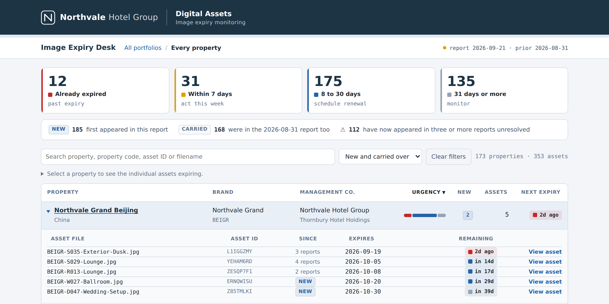
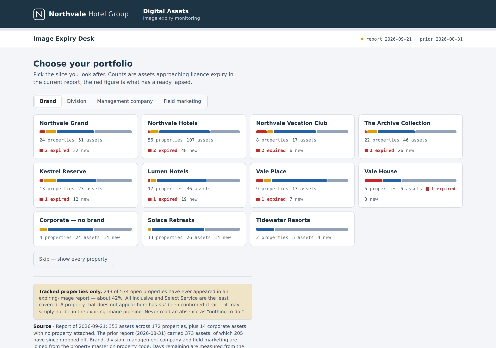
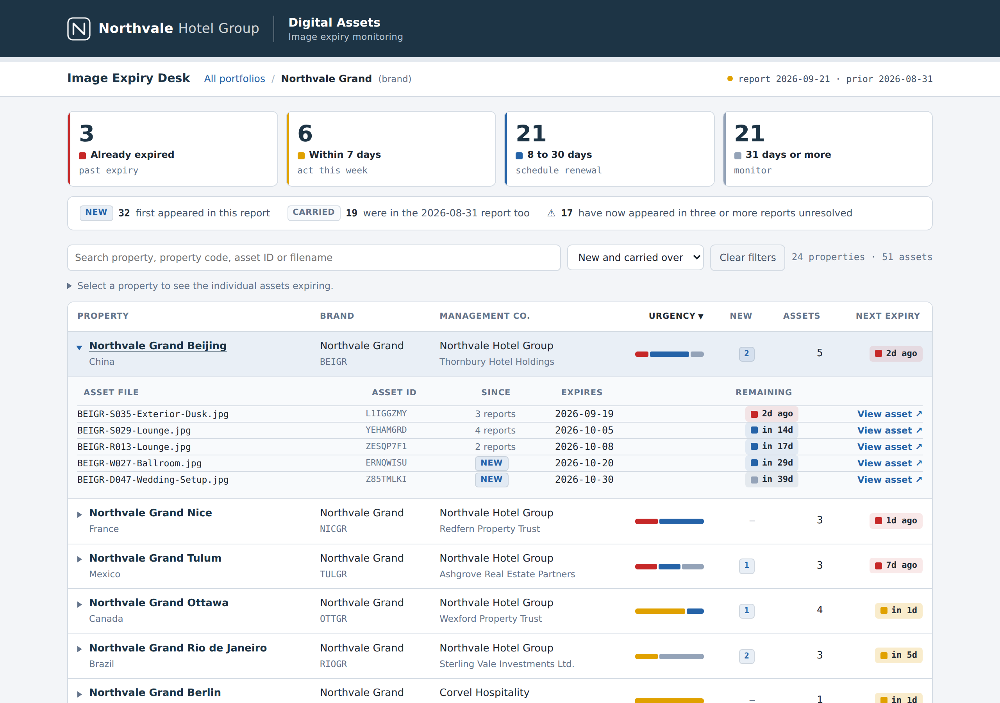

# Image Expiry Desk

A small data pipeline and self-contained dashboard that helps a hotel group's
marketing teams see which licensed photos are about to expire, who owns each
one, and what has changed since the last report.



**[Open the live demo →](https://llambrano.github.io/image-expiry-desk/)**

One self-contained HTML file, served by GitHub Pages. No server, no build step
at view time, no database. Clone the repo and open `docs/index.html` and you
get the same page offline.

---

> **All data in this repository is synthetic.** "Northvale Hotel Group", its
> brands, properties, owners, operators, people, asset IDs and URLs are
> invented. Asset URLs point to `example.com`, a domain reserved for
> documentation, and "View asset" shows a sample illustration instead.

## The problem

Hotel photography is licensed for a fixed term. A digital asset management
(DAM) system emits a periodic "expiring images" export, but the raw file is
hard to act on:

- it lists hundreds of assets with no owner, brand context or history
- the same asset shows up report after report with no sign it is being ignored
- property codes, brand names and URLs are inconsistent between exports
- nothing says which properties are *not* in the pipeline at all

The Image Expiry Desk turns that export into a view each team can open, pick
their slice of the portfolio (brand, division, management company or field
marketing manager), and see exactly what to renew this week.

## What the dashboard does

- **Portfolio chooser** - cards per brand, division, management company or
  field marketing owner, each with an urgency bar and expired count
- **Urgency tiles** - already expired / within 7 days / 8-30 days / 31+ days,
  clickable as filters
- **Change since last report** - which assets are new, which were carried over,
  and which have now appeared in three or more reports unresolved
- **Property drill-down** - expand a property to see each asset, its expiry
  date, days remaining and a link to the file
- **Coverage caveat** - how many open properties have ever appeared in the
  pipeline, so an absence is never read as "nothing to do"
- Single HTML file, no server, light and dark mode, keyboard accessible
- **Sample images** - "View asset" opens one of ten original illustrations in
  `docs/assets/sample-images/`, matched to the asset's room type (drawn in
  code by `scripts/make_sample_images.py`)





## Pipeline

```
scripts/generate_synthetic_data.py   ->  data/raw/<year>/*.xlsx          (44 report runs, 2023-2026)
                                         data/reference/property_master.csv
scripts/make_sample_images.py        ->  docs/assets/sample-images/*.png (10 placeholder photos)
pipeline/clean_reports.py            ->  data/clean/expiring_images_clean.csv
                                         data/clean/cleaning_log.txt
                                         data/clean/unmatched_property_codes.csv
dashboard/build_dashboard.py         ->  docs/index.html
```

### Data quality fixes

The synthetic exports reproduce the defects found in real DAM exports, and the
cleaning step fixes each one with an audit counter in `cleaning_log.txt`:

| Issue in the raw export | Fix |
|---|---|
| "Preview" column is the literal text "Click Here" | dropped; the URL column carries the link |
| File extension doesn't match the real format | format detected from magic bytes |
| Same report re-sent twice | detected by content hash, duplicate skipped |
| Spaces in asset URLs | percent-encoded |
| Brand slug spelling drifts between exports | collapsed to one canonical slug |
| Property codes in mixed case | lowercased |
| Property renamed mid-history | dimensions joined from the master on code, so the latest name wins |
| One asset licensed to several properties | exploded to one row per property |
| Codes missing from the master | logged to `unmatched_property_codes.csv` |
| Assets on internal / staging hosts, already expired at issue | flagged as derived columns |

## Run it

```bash
python -m venv .venv && source .venv/bin/activate
pip install -r requirements.txt

make            # or run the three scripts in order
open docs/index.html
```

The generator is deterministic (fixed seed), so every run produces the same
dataset.

Days remaining are measured from the report date so the demo reads sensibly
whenever it is opened. Add `?asof=today` to the URL to measure from the
current date, as the production version did.

## Live demo

**[llambrano.github.io/image-expiry-desk](https://llambrano.github.io/image-expiry-desk/)**,
served by GitHub Pages from the `/docs` folder of the `main` branch. Rebuilding
the dashboard (`make`) updates `docs/index.html`, and the next push publishes it.

## Tech

Python (pandas, openpyxl) for generation and cleaning; plain HTML, CSS and
vanilla JavaScript for the dashboard, with the data inlined as JSON.

## License

MIT
